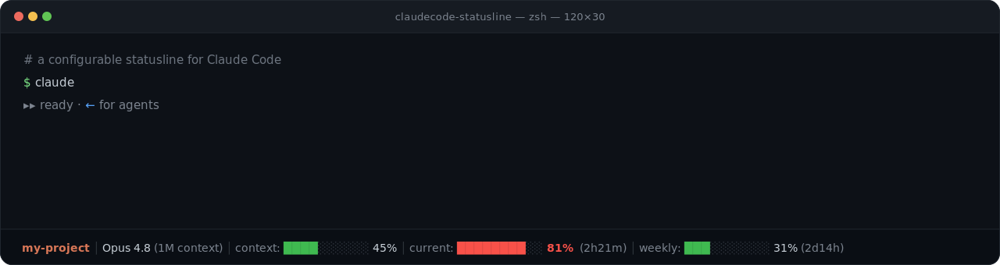

<h1 align="center">Claude Code Statusline</h1>

<p align="center">
  A lightweight, zero-config statusline for Claude Code.
</p>

<p align="center">
  <a href="https://www.npmjs.com/package/ctxline-claude">
    
  </a>
  <a href="https://www.npmjs.com/package/ctxline-claude">
    
  </a>
  <a href="LICENSE">
    
  </a>
  <a href="https://github.com/MithunWijayasiri/claudecode-statusline/stargazers">
    
  </a>
</p>

<p align="center">
  
</p>

<p align="center">
  Monitor context usage, session limits, and weekly allowance without leaving Claude Code.
</p>

See your **current directory**, **active model**, **context window usage**, and **Claude usage limits** at a glance — including both your **current 5-hour session** and **weekly allowance**.

## Install

```bash
npx ctxline-claude     # or: bunx ctxline-claude
```

Then restart Claude Code or start a new session. That's it.

<details>
<summary>Other install methods</summary>

**Clone & run the installer:**

```bash
git clone https://github.com/MithunWijayasiri/claudecode-statusline.git
cd claudecode-statusline
./install.sh      # macOS / Linux
./install.ps1     # Windows (PowerShell)
```

**Manual:** download the script, then point `~/.claude/settings.json` at it.

```bash
curl -o ~/.claude/hooks/statusline.js https://raw.githubusercontent.com/MithunWijayasiri/claudecode-statusline/main/statusline.js
chmod +x ~/.claude/hooks/statusline.js
```

```json
{
  "statusLine": {
    "type": "command",
    "command": "node ~/.claude/hooks/statusline.js"
  }
}
```

</details>

## Uninstall

```bash
npx ctxline-claude uninstall
```

Removes the `statusLine` entry from `settings.json` (backed up first, other settings untouched), deletes the hook script, and clears the usage cache. If `settings.json` points at a different statusline, it's left alone.

<details>
<summary>Manual uninstall</summary>

Undo the two things the installer did — remove the `statusLine` block from `~/.claude/settings.json` (a timestamped `settings.json.backup.<n>` exists if you'd rather restore), then delete the script:

```bash
# macOS / Linux
rm ~/.claude/hooks/statusline.js
rm -f ~/.claude/cache/usage-cache.json   # optional: clears cached usage
```

```powershell
# Windows (PowerShell)
Remove-Item "$env:USERPROFILE\.claude\hooks\statusline.js"
Remove-Item "$env:USERPROFILE\.claude\cache\usage-cache.json" -ErrorAction SilentlyContinue
```

</details>

## What it shows

| Segment | Detail |
|---|---|
| **Directory** | Current working directory |
| **Model** | Active Claude model (Opus / Sonnet / Haiku) |
| **Context** | Visual bar of context-window usage |
| **Current** | Live 5-hour session limit + reset countdown (subscription users) |
| **Weekly** | Weekly usage allowance + time until the weekly reset (subscription users) |
| **Task** | The in-progress todo, when there is one |

> [!NOTE]
> Usage bars change color automatically as you approach your limits.

## How it works

- **Source** — context comes from Claude Code's session data. Usage bars are read straight from the `rate_limits` field Claude Code pipes in (no network), falling back to `https://api.anthropic.com/api/oauth/usage` (the same `/usage` data — 5-hour and weekly limits) when that field isn't present yet. API-key users skip usage entirely.
- **No network on the fast path** — when `rate_limits` is in the session data, there's no API call at all. The fetch below only runs as a fallback (e.g. the first render of a session, before the field appears).
- **Adaptive timing** — for the fallback fetch: 1.5s timeout on the first prompt (cold start), 1.2s after (connection reused).
- **Caching** — the fallback fetch is cached at `~/.claude/cache/usage-cache.json`, shared across sessions. Within 30s the cache renders directly (the API call is skipped); if a live call fails, the last value (up to 10 min old) is shown so the bar never vanishes. The reset countdown recomputes every render.
- **Never breaks** — every failure path falls back silently; the statusline always prints.

## FAQ

<details>
<summary>Does this use the same data as /usage?</summary>

Yes — the same 5-hour and weekly limits. It reads them from the session data Claude Code provides when available, and falls back to Anthropic's usage API (the endpoint `/usage` uses) otherwise.

</details>

<details>
<summary>Does it work with API keys?</summary>

Yes. The statusline automatically detects subscription vs API-key usage.

</details>

<details>
<summary>Can it break Claude Code?</summary>

No. All failures are handled silently and the statusline always renders.

</details>

<details>
<summary>Does it expose my API keys / auth tokens?</summary>

No. Your credentials never leave your machine. On the fast path no token is read at all — usage comes straight from the session data. Only on the fallback fetch is the OAuth token read locally (from `~/.claude/.credentials.json` or the macOS keychain), used solely to authenticate the request to Anthropic's own usage API — the same endpoint `/usage` uses. Nothing is sent to any third party, logged, or cached; only the resulting usage percentages are stored locally.

</details>

## License

MIT

## Credits

Thanks to [@TahaSabir0](https://github.com/TahaSabir0) for the base config.
